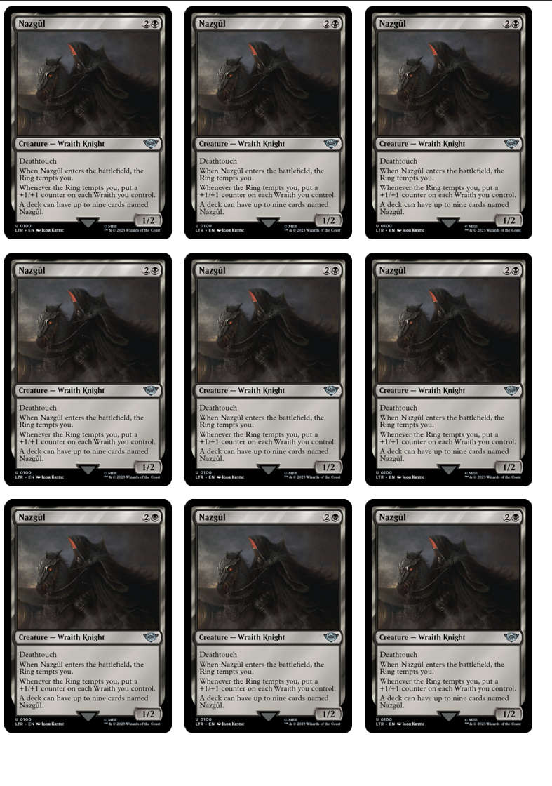

# Description

Simple script to generate pdf grid layout with provided images. Useful for printing proxies for card games etc.

Example of the pdf output with MARGIN=2, SPACING=5:



# Usage

Install [Python](https://www.python.org/downloads/). Check the settings at the top of the main.py and put all the images in the folder INPUT_DIR (default name images). Then:

```bash
# install the required packages
pip install -r requirements.txt
# run the program
python main.py
```
